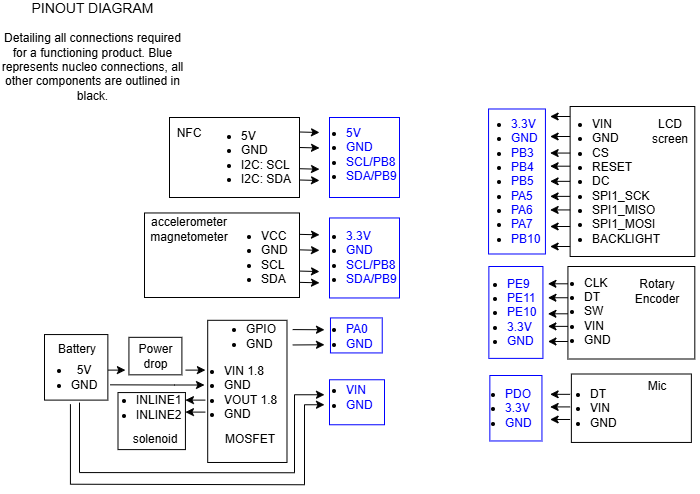

# [Locked in] The Phone Lock Box #
**An EECS 373 Embedded Systems Project - WN2025**

This project is a lockbox for your phone, designed to reduce distractions and help students stay focused. Here, we outline the various modules, provide a system overview, and describe our hardware setup. Specific functions and their implementations are covered within their respective modules and are not detailed here.

## Module Overview ##
Below are the main modules we implemented and designed, along with brief descriptions of each. For further details on their functionality, please refer to the individual files (particularly for non-trivial functions).  
- [`Shared.h`](PhoneLockBox/Core/Inc/shared.h) — Contains project-wide definitions, data types, and some debug-specific functions.
- [`accelerometer.c`](PhoneLockBox/Core/Src/accelerometer.c) — Holds all the implementation details relevant to the accelerometer and magnetometer, including their event functions.
- [`audio.c`](PhoneLockBox/Core/Src/audio.c) — Where all the audio detection and unlocking functions exist. The header file contains the tuning parameters.
- [`event_controller.c`](PhoneLockBox/Core/Src/event_controller.c) — This is our very minimal real-time operating system. It implements a very bare-bones scheduler that takes in all of our non-interrupt-based events/processes and runs them either periodically, once, or for some n times.
- [`lock_timer.c`](PhoneLockBox/Core/Src/lock_timer.c) — Our main box timer and lock implementation are housed here. The global lock timer is separated from our event system to preserve some of our scheduler's invariants.
- [`main.c`](PhoneLockBox/Core/Src/main.c) — Contains the main system loop and calls a few initialization functions. Also has the code for driving the dial-to-timer interaction when users are inputting the locking time.
- [`nfc.c`](PhoneLockBox/Core/Src/nfc.c) — The wrapper on top of the PN532 library (credit to Yehui), where our event system entry point and flag interactions live.
- [`rotary_encoder.c`](PhoneLockBox/Core/Src/rotary_encoder.c) — Handles some initialization of the quadrature decoding and event callbacks for wake-up events (i.e., the dial has been turned).
- [`Screen_driver.c`](PhoneLockBox/Core/Src/Screen_driver.c) — The modified library and our display code for driving our TFT-LCD display.
- [`state_machine.c`](PhoneLockBox/Core/Src/state_machine.c) — The main driver of our program, where events are scheduled, flags are checked, and box outputs are controlled based on our state (see below for our state diagram).

## Program Flow Overview ##
Below is a high-level overview of a typical interaction with the system. Each step references a broad set of states that are group together based on their general role (For a complete visual reference, see the state diagram below). 

### Startup ###
Upon power-up, the system calls the initialization functions for all key modules. This includes setting up I2C and SPI connections to communicate with the NFC reader, accelerometer, and display.  
After hardware setup, the internal systems — the state machine, event system, and master timer — are initialized to their default states. Finally, all interrupts are disabled to ensure they are only selectively enabled when required by specific states.

The state machine begins in the **Sleep State**, where the box schedules only the events relevant to wake-up detection (accelerometer and rotary encoder polling).  
This scheduling is handled via `eventRegister()`, where the appropriate sensor entry functions are registered.  
Additionally, the rotary encoder interrupt is enabled to detect user interaction.

### Unlocked States

When the system is woken from sleep (via motion or dial interaction), it transitions to an **Unlocked State** where the user can set a desired lock duration.

Unlike most modules that rely entirely on scheduled events, the timer setting interface reads the rotary encoder count directly and updates Timer 2’s counter register accordingly. This design ensures responsive user input handling.

After the user places a phone into the box, the NFC reader detects its presence and sets the `NFC_PHONE_PRESENT` flag.  
This triggers a transition where the user is prompted to confirm the lock.  
When the switch interrupt fires (signaling user confirmation), the system moves into a **Cancelable Lock State**.  
After a 5-second countdown (managed by the event system), the `TIMER_COMPLETE` flag is set, finalizing the transition into the **Locked State**.  
At this point, Timer 2 begins counting down, and the solenoid is engaged to physically lock the box.

### Locked States

The Locked States introduce unique behaviors, particularly around audio monitoring and unlock conditions.

The microphone monitors ambient noise and triggers an interrupt when a loud event is detected.  
This sets the `AUDIO_HIGH` flag, causing the system to transition into an **Audio Monitoring State** (either an "awake" or "asleep," depending on the previous state).

The Locked State can be exited through **three distinct paths**:
- **Forced Entry Detection** (via magnetometer events)
- **Audio Match Unlock** (successful pattern detected after an audio trigger)
- **Master Timer Expiry**

Notably, the master timer is managed differently from other event-driven systems to maintain a core invariant of the design is that no event persistence between states.  
This invariant ensures minimal active scheduling at any given time, simplifying the system’s complexity and improving robustness.

## Hardware Overview ##
Below are a few of our hardware diagrams that we used to help visualize and plan for the physical parts of our project.

 

